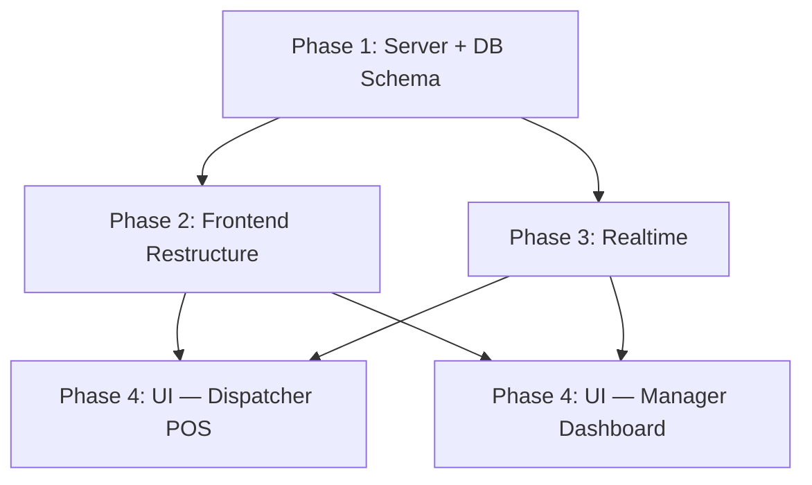

# Gas Station Management System — Redesign Plan

Restructure `pumps-flecha` from a localStorage-only single-page prototype into a multi-role gas station management platform with a backend API, PostgreSQL persistence, Redis-powered realtime, and role-based views — all within the `pumps/` workspace.

---

## Current State — `pumps/` Only

| Aspect       | Current                                                       | Target                                                 |
| ------------ | ------------------------------------------------------------- | ------------------------------------------------------ |
| **Stack**    | React 19 + Vite 7 + TailwindCSS 4 + shadcn/ui + Framer Motion | Same stack, add routing + API layer + WebSocket client |
| **State**    | `localStorage` only — all data device-local                   | PostgreSQL via backend API                             |
| **Auth**     | None                                                          | Custom JWT with numeric PIN-pad login                  |
| **Backend**  | None                                                          | New Express/Bun service inside `pumps/server/`         |
| **Realtime** | None                                                          | Redis Pub/Sub → WebSocket push                         |
| **UI**       | Single dark-mode POS view for all users                       | Role-based: Dispatcher POS + Manager M3 Dashboard      |

### Files in scope

```
pumps/
├── index.html                    # Title: "Volumetrico"
├── package.json                  # pumps-flecha, React 19, Vite 7, TW4, shadcn, framer-motion
├── components.json               # shadcn new-york style, neutral base
├── vite.config.ts                # react-swc + tailwind plugins, @/ alias
├── src/
│   ├── main.tsx                  # StrictMode + createRoot
│   ├── App.tsx                   # Monolithic: header, dashboard, pump carousel, withdrawals, settings
│   ├── App.css                   # Unused Vite boilerplate CSS
│   ├── index.css                 # shadcn theme tokens (light + dark)
│   ├── lib/utils.ts              # cn() utility
│   ├── types/html-to-image.d.ts  # Type shim
│   ├── components/
│   │   ├── dashboard.tsx         # Cash-in-hand hero, stats grid, fuel breakdown
│   │   ├── pump-card.tsx         # Pump carousel card (Regular/Premium inputs)
│   │   ├── withdrawal-manager.tsx# Add/remove withdrawals
│   │   ├── settings-drawer.tsx   # Bottom sheet for price config
│   │   ├── share-button.tsx      # Screenshot → native share / download
│   │   └── ui/                   # shadcn: button, input, label, badge
```

**Key observations:**

- [App.tsx](file:///Users/rick/dev/byrick.net/pumps/src/App.tsx) is ~315 lines doing everything: state, layout, routing, calculations
- All types are inline (duplicated across files) — no shared types
- `App.css` is leftover Vite boilerplate — unused
- The dark-mode carousel UI is polished and worth preserving for the Dispatcher view
- `html-to-image` is used for the share/screenshot feature
- No routing, no auth, no API calls — pure client-side

---

## User Review Required

> [!IMPORTANT]
> **Monorepo structure**: I propose putting the backend inside `pumps/server/` as a co-located service (separate `package.json`, separate build). This keeps everything in one repo while maintaining clean separation. The alternative is a sibling `api/pumps/` folder outside this workspace. **Which do you prefer?**

> [!IMPORTANT]
> **Single SPA with routing**: Both Dispatcher POS and Manager Dashboard will be routes within the same Vite app (`/login`, `/dispatch/*`, `/manage/*`), with role-based redirects after PIN login. This keeps deployment to a single build. **Confirm this approach.**

> [!WARNING]
> **TailwindCSS**: The project already uses TailwindCSS 4 with shadcn/ui. I'll continue with this stack rather than vanilla CSS, since the existing component library depends on it.

---

## Open Questions

1. **Number of pumps**: Is 4 always fixed, or should pump count be configurable by the Manager?
2. **Phase 1 scope for non-cash transactions**: Should Card/Credit transaction forms be included in the first build, or ship with cash-only + withdrawals first and add Card/Credit in Phase 2?
3. **VPS details**: Same VPS and Postgres instance you use for other services? What port range is available for the pumps API?
4. **Shift assignments**: Should a Dispatcher see **only their assigned pump(s)**, or all pumps like the current UI?
5. **Credit categories**: How many corporate credit programs do you expect? (Ticketcar, Effecticar — any others?)

---

## Proposed Changes

### Phase 1 — Backend Service + Database

Create a new backend service co-located in the pumps workspace.

#### [NEW] `pumps/server/` — Backend API service

```
server/
├── .env.example
├── package.json               # express, pg, ioredis, jsonwebtoken, bcryptjs, socket.io, tsx
├── tsconfig.json
├── migrations/
│   ├── 001_pumps_schema.sql   # Full schema from spec (ENUMs, all tables)
│   └── 002_seed_data.sql      # Gas types, pumps, hoses, initial Manager user
└── src/
    ├── index.ts               # Express + Socket.io bootstrap
    ├── lib/
    │   ├── db.ts              # pg Pool
    │   ├── redis.ts           # ioredis client
    │   └── tokens.ts          # JWT sign/verify for PIN auth
    ├── middleware/
    │   ├── requireAuth.ts     # JWT verification
    │   └── requireRole.ts     # Role-based guard (Manager, Cashier, Dispatcher)
    ├── routes/
    │   ├── auth.ts            # POST /login (PIN-based), POST /refresh
    │   ├── pumps.ts           # GET /pumps (all pumps + hoses)
    │   ├── shifts.ts          # POST /shifts (open), PATCH /shifts/:id/close
    │   ├── readings.ts        # POST /readings, PATCH /readings/:id
    │   ├── transactions.ts    # POST /transactions (Cash/Card/Credit)
    │   ├── withdrawals.ts     # POST /withdrawals, GET /withdrawals
    │   ├── prices.ts          # GET /prices/current, POST /prices
    │   ├── credits.ts         # CRUD credit categories
    │   ├── users.ts           # CRUD users (Manager only)
    │   └── dashboard.ts       # GET /dashboard/summary (aggregated metrics)
    └── realtime/
        ├── publisher.ts       # Redis PUBLISH on withdrawal/shift events
        └── subscriber.ts      # Redis SUBSCRIBE → Socket.io broadcast
```

**Database schema** — exactly as specified in your plan, with these refinements:

- All `TIMESTAMP` → `TIMESTAMPTZ` for timezone safety
- Add `UNIQUE(shift_id, pump_id)` on `shift_assignments` to prevent double-assigning
- Add index on `gas_prices(gas_type_id, effective_from DESC)` for fast current-price lookups
- Add `updated_at` columns + trigger functions

**API endpoints:**

| Method  | Path                         | Role       | Description                                     |
| ------- | ---------------------------- | ---------- | ----------------------------------------------- |
| `POST`  | `/api/auth/login`            | Public     | PIN-pad authentication → JWT                    |
| `POST`  | `/api/auth/refresh`          | Public     | Refresh token rotation                          |
| `GET`   | `/api/shifts/active`         | Auth       | Get current open shift                          |
| `POST`  | `/api/shifts`                | Manager    | Open a new shift with assignments               |
| `PATCH` | `/api/shifts/:id/close`      | Manager    | Close a shift (sets end readings)               |
| `GET`   | `/api/pumps`                 | Auth       | List all pumps + hoses + gas types              |
| `POST`  | `/api/readings`              | Dispatcher | Submit start/end meter readings                 |
| `POST`  | `/api/withdrawals`           | Dispatcher | Log a cash withdrawal → triggers realtime event |
| `GET`   | `/api/withdrawals?shift_id=` | Auth       | List withdrawals for a shift                    |
| `POST`  | `/api/transactions`          | Dispatcher | Log card/credit transaction                     |
| `GET`   | `/api/prices/current`        | Auth       | Current price per gas type                      |
| `POST`  | `/api/prices`                | Manager    | Set new price (appends row — never mutates)     |
| `GET`   | `/api/dashboard/summary`     | Manager    | Aggregated shift metrics for dashboard          |
| CRUD    | `/api/users`                 | Manager    | Manage dispatchers/cashiers                     |
| CRUD    | `/api/credits`               | Manager    | Manage credit categories                        |

---

### Phase 2 — Frontend Restructuring

#### [MODIFY] [package.json](file:///Users/rick/dev/byrick.net/pumps/package.json)

Add dependencies:

- `react-router-dom` — client-side routing
- `socket.io-client` — WebSocket client
- `@tanstack/react-query` — server state management
- `sonner` — toast notifications for realtime events

#### [DELETE] [App.css](file:///Users/rick/dev/byrick.net/pumps/src/App.css)

Unused Vite boilerplate — all styling is via Tailwind classes.

#### [MODIFY] [main.tsx](file:///Users/rick/dev/byrick.net/pumps/src/main.tsx)

Wrap with `BrowserRouter`, `QueryClientProvider`, and `AuthProvider`.

#### [MODIFY] [App.tsx](file:///Users/rick/dev/byrick.net/pumps/src/App.tsx)

Replace the monolithic component with a route shell:

```tsx
// Route structure:
// /login           → PinLogin page
// /dispatch/*      → DispatcherLayout (requires Dispatcher role)
// /manage/*        → ManagerLayout (requires Manager role)
// /                → redirect based on role
```

#### New file structure under `src/`:

```
src/
├── main.tsx                        # Router + Providers
├── App.tsx                         # Route definitions
├── index.css                       # Existing shadcn tokens (unchanged)
├── lib/
│   ├── utils.ts                    # Existing cn() (unchanged)
│   ├── api.ts                      # [NEW] Fetch wrapper with JWT interceptor
│   ├── socket.ts                   # [NEW] Socket.io client with auto-reconnect
│   └── auth.ts                     # [NEW] JWT storage, refresh logic
├── hooks/
│   ├── useAuth.ts                  # [NEW] Auth state hook
│   ├── useSocket.ts                # [NEW] Socket.io event subscriptions
│   └── useShift.ts                 # [NEW] Active shift data hook
├── contexts/
│   └── AuthContext.tsx             # [NEW] Provider: user, role, tokens, login/logout
├── types/
│   ├── html-to-image.d.ts         # Existing (unchanged)
│   └── index.ts                    # [NEW] Shared TypeScript types from DB schema
├── pages/
│   ├── Login.tsx                   # [NEW] Full-screen PIN-pad login
│   ├── dispatcher/
│   │   ├── DispatcherLayout.tsx    # [NEW] Dark POS shell (header + outlet)
│   │   └── PumpView.tsx            # [NEW] Evolved from current App.tsx
│   └── manager/
│       ├── ManagerLayout.tsx       # [NEW] M3 sidebar layout
│       ├── DashboardPage.tsx       # [NEW] Live shift widgets
│       ├── PricesPage.tsx          # [NEW] Gas price management
│       ├── CreditsPage.tsx         # [NEW] Credit category CRUD
│       ├── UsersPage.tsx           # [NEW] User management
│       └── ShiftHistoryPage.tsx    # [NEW] Past shifts & reports
├── components/
│   ├── ui/                         # Existing shadcn (unchanged)
│   ├── shared/
│   │   ├── PinPad.tsx              # [NEW] Numeric keypad component
│   │   └── ProtectedRoute.tsx      # [NEW] Role-based route guard
│   ├── dispatcher/
│   │   ├── PumpCard.tsx            # [EVOLVE] from existing pump-card.tsx — wired to API
│   │   ├── Dashboard.tsx           # [EVOLVE] from existing dashboard.tsx — wired to API
│   │   ├── WithdrawalManager.tsx   # [EVOLVE] from existing — wired to API
│   │   ├── SettingsDrawer.tsx      # [EVOLVE] from existing — prices from API
│   │   ├── ShareButton.tsx         # [KEEP] existing share-button.tsx
│   │   └── TransactionForm.tsx     # [NEW] Card/Credit entry
│   └── manager/
│       ├── ShiftStatusGrid.tsx     # [NEW] Live grid of active dispatchers
│       ├── WithdrawalFeed.tsx      # [NEW] Realtime withdrawal feed
│       ├── MetricCard.tsx          # [NEW] M3-style summary card
│       ├── PriceTable.tsx          # [NEW] Price history table + update form
│       └── CreditTree.tsx          # [NEW] Nested credit category editor
```

---

### Phase 3 — Realtime Integration

#### WebSocket events

| Channel / Event      | Direction       | Who listens                   | Trigger                          |
| -------------------- | --------------- | ----------------------------- | -------------------------------- |
| `withdrawal:created` | Server → Client | Manager, Cashier              | Dispatcher submits a withdrawal  |
| `shift:opened`       | Server → Client | All                           | Manager opens a new shift        |
| `shift:closed`       | Server → Client | All (force-exits Dispatchers) | Manager closes a shift           |
| `reading:updated`    | Server → Client | Manager                       | Dispatcher updates meter reading |

**Flow:**

1. API route handler completes DB insert/update
2. `publisher.ts` calls `redis.publish('pumps:<event>', payload)`
3. `subscriber.ts` (running in the same process) receives via `redis.subscribe()`
4. Broadcasts to Socket.io rooms (`managers`, `dispatchers`)
5. Frontend `useSocket` hook receives event → triggers React Query invalidation + toast

---

### Phase 4 — UI Implementation

#### Login Page — Full-screen PIN Pad

- Dark background matching the existing aesthetic
- User ID input at top (numeric)
- 4-6 digit PIN with dot indicators
- 3×4 numeric grid + backspace/submit row
- Large touch targets (min 56px), high contrast
- Error shake animation on invalid PIN (Framer Motion)

#### Dispatcher POS (preserve & evolve current dark UI)

- **Keep**: carousel, dashboard hero card, withdrawal manager, dark gradient aesthetic
- **Wire**: all state reads from API via React Query, all writes via mutations
- **Add**: non-cash transaction form (Card type, last 4 digits / Credit category)
- **Add**: realtime toast on shift closure (auto-redirect to login)
- **Add**: start/end reading submission tied to shift lifecycle

#### Manager Dashboard (M3-inspired, light mode)

- Sidebar navigation with route links
- **Live Shift Status**: grid of cards per active dispatcher — pump, liters dispensed, cash expected
- **Realtime Withdrawal Feed**: live-updating scrolling list via WebSocket
- **Summary Metrics**: total sales, total liters, expected cash across all pumps
- **Price Management**: historical price table + "Set New Price" action (append-only)
- **Credit Management**: nested tree for corporate credit categories
- **User Management**: table of dispatchers/cashiers with PIN reset + activate/deactivate

---

## Verification Plan

### Automated Tests

1. **Database**: Run migrations against a fresh Postgres instance — verify all tables, indexes, constraints, triggers
2. **API**: Test all endpoints with `curl`:
   - PIN login → JWT returned
   - Role guards: Dispatcher blocked from Manager routes, vice versa
   - Price POST appends new row (never mutates)
   - Withdrawal POST triggers Redis publish
3. **Realtime**: Connect Socket.io test client, verify events broadcast on withdrawal/shift actions
4. **Frontend**: `npm run build` — zero TypeScript errors

### Browser Tests

- PIN-pad login flow on mobile viewport (touch targets)
- Dispatcher: pump carousel, meter reading entry, withdrawal submission
- Manager: dashboard loads metrics, realtime withdrawal feed updates
- Role routing: Dispatcher can't navigate to `/manage/*`

### Manual Verification

- Deploy to VPS
- Two-tab test: Manager dashboard + Dispatcher POS — withdrawal in Dispatcher triggers live toast in Manager
- Night-shift readability on the dark-mode POS view

---

## Execution Order



| Phase | What                                           | Estimated Effort |
| ----- | ---------------------------------------------- | ---------------- |
| 1     | Backend service, DB schema, API routes         | ~3-4 hours       |
| 2     | Frontend routing, providers, API client, types | ~2-3 hours       |
| 3     | Redis pub/sub, Socket.io, useSocket hook       | ~1-2 hours       |
| 4     | Dispatcher POS evolution + Manager Dashboard   | ~3-4 hours       |
